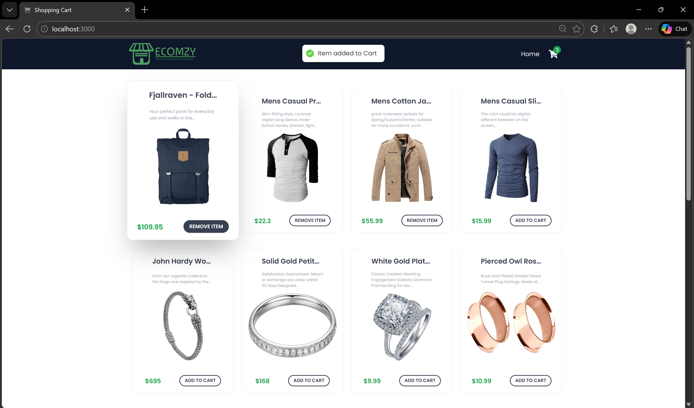

# Shopping Cart App (React + Redux Toolkit)

A modern e-commerce shopping cart application built using React.js, Redux Toolkit, and Tailwind CSS. The application allows users to browse products, add or remove items from the cart, and view real-time cart totals with a clean and responsive UI.

---

## Features

* Fetches product data from FakeStore API
* Add and remove products from the shopping cart
* Real-time cart total calculation
* Client-side routing using React Router DOM
* Global state management using Redux Toolkit
* Loading spinner during API calls
* Toast notifications for cart actions
* Fully responsive UI with Tailwind CSS

---

## Tech Stack

**Frontend**

* React.js
* JavaScript (ES6+)
* Tailwind CSS

**State Management**

* Redux Toolkit
* React Redux

**Routing & Utilities**

* React Router DOM
* React Hot Toast

**API**

* FakeStore API

---

## Project Structure

```
shopping-cart-app/
│
├── public/
│
├── src/
│   ├── components/
│   │   ├── CartItem.jsx
│   │   ├── Navbar.jsx
│   │   ├── Product.jsx
│   │   └── Spinner.jsx
│   │
│   ├── pages/
│   │   ├── Home.jsx
│   │   └── Cart.jsx
│   │
│   ├── redux/
│   │   ├── Slices/
│   │   │   └── CartSlice.js
│   │   └── Store.js
│   │
│   ├── App.jsx
│   ├── data.js
│   ├── index.css
│   └── index.js
│
├── package.json
├── postcss.config.js
├── README.md
└── .gitignore
```

---

## How It Works

### Home Page

* Fetches products from an external REST API
* Displays products using reusable Product components
* Shows a loading spinner while data is being fetched

### Cart Page

* Displays selected cart items
* Calculates total price dynamically
* Allows users to remove items from the cart
* Shows an empty cart state when no items are added

### State Management

* Cart data is managed globally using Redux Toolkit
* Actions and reducers are defined inside CartSlice
* useSelector and useDispatch hooks are used for state access

---

## Installation and Setup

1. Clone the repository

```bash
git clone https://github.com/your-username/shopping-cart-app.git
```

2. Navigate to the project directory

```bash
cd shopping-cart-app
```

3. Install dependencies

```bash
npm install
```

4. Run the development server

```bash
npm start
```

5. Open your browser and visit

```
http://localhost:3000
```

---

## Screenshots


```md

```

---

## Future Enhancements

* Quantity increment and decrement functionality
* Cart persistence using localStorage
* Product filtering by category and price
* Checkout flow simulation
* Dark mode support

---

## Author

Arshnoor Singh
Email: [arshnoorsingh.05@gmail.com](mailto:arshnoorsingh.05@gmail.com)
GitHub | LinkedIn

---

