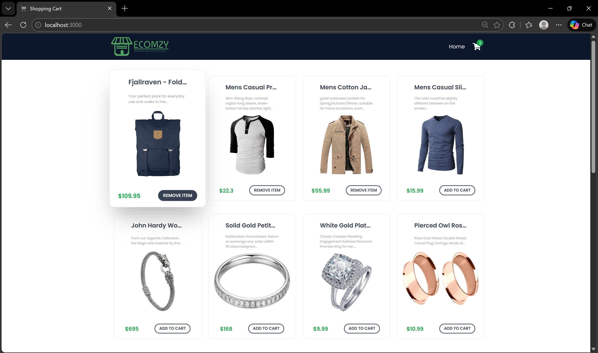

# Shopping Cart App (React + Redux Toolkit)

A modern and responsive e-commerce shopping cart application built using **React.js**, **Redux Toolkit**, and **Tailwind CSS**. The application allows users to browse products, add or remove items from the cart, and view real-time cart totals with an intuitive and clean user interface.

---

## Live Demo

https://shopping-cart-app-eta-five.vercel.app/

---

## Features

- Fetches product data from the FakeStore API
- Add products to the shopping cart
- Remove products from the shopping cart
- Real-time cart total calculation
- Global state management using Redux Toolkit
- Client-side routing with React Router DOM
- Loading spinner during API requests
- Toast notifications for user actions
- Fully responsive design for desktop, tablet, and mobile devices

---

## Tech Stack

### Frontend

- React.js
- JavaScript (ES6+)
- Tailwind CSS

### State Management

- Redux Toolkit
- React Redux

### Routing & Utilities

- React Router DOM
- React Hot Toast

### API

- FakeStore API

### Deployment

- Vercel

---

## Project Structure

```text
shopping-cart-app/
│
├── public/
│
├── src/
│   ├── components/
│   │   ├── CartItem.jsx
│   │   ├── Navbar.jsx
│   │   ├── Product.jsx
│   │   └── Spinner.jsx
│   │
│   ├── pages/
│   │   ├── Cart.jsx
│   │   └── Home.jsx
│   │
│   ├── redux/
│   │   ├── Slices/
│   │   │   └── cartSlice.js
│   │   └── Store.js
│   │
│   ├── App.jsx
│   ├── data.js
│   ├── index.css
│   └── index.js
│
├── Screenshots/
│   └── home.png
│
├── package.json
├── package-lock.json
├── postcss.config.js
├── tailwind.config.js
└── README.md
```

---

## How It Works

### Home Page

- Fetches product data from the FakeStore API
- Displays products using reusable Product components
- Shows a loading spinner while products are loading

### Cart Page

- Displays all selected products
- Calculates the total cart value dynamically
- Allows users to remove products from the cart
- Displays an empty cart state when no products are added

### State Management

- Cart state is managed globally using Redux Toolkit
- Actions and reducers are defined inside `cartSlice.js`
- Uses `useSelector` and `useDispatch` for accessing and updating the store

---

## Installation and Setup

### 1. Clone the repository

```bash
git clone https://github.com/ArshnoorSingh07/Shopping-Cart-App.git
```

### 2. Navigate to the project directory

```bash
cd Shopping-Cart-App
```

### 3. Install dependencies

```bash
npm install
```

### 4. Start the development server

```bash
npm start
```

### 5. Build for production

```bash
npm run build
```

---

## Screenshots

### Home Page



---

## Future Enhancements

- Increase and decrease product quantity
- Save cart data using Local Storage
- Product search functionality
- Category and price filters
- Checkout flow simulation
- Dark mode support
- Wishlist functionality

---

## Author

**Arshnoor Singh**

- GitHub: https://github.com/ArshnoorSingh07
- Email: arshnoorsingh.05@gmail.com

---

## License

This project is intended for learning and educational purposes.