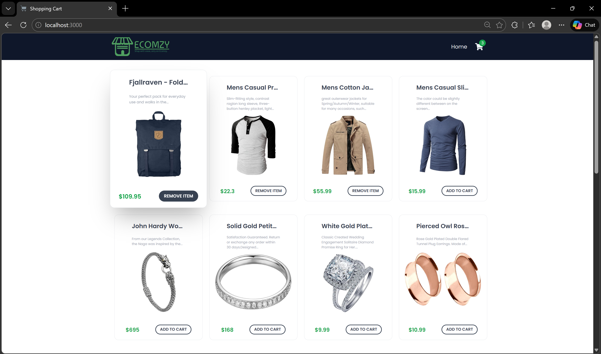

# Shopping Cart App

A modern and responsive e-commerce shopping cart application built using **React.js**, **Redux Toolkit**, **Tailwind CSS**, and **Razorpay Checkout**. The application allows users to browse products, manage cart items, view real-time totals, and complete checkout through Razorpay.

---

## Live Demo

- **Vercel:** https://shopping-cart-app-eta-five.vercel.app/
- **AWS CloudFront:** https://d3bsis67to124.cloudfront.net/

---

## Features

- Fetches product data dynamically from the **FakeStore API**
- Add products to the shopping cart
- Remove products from the shopping cart
- Real-time cart total calculation
- Global cart state management using **Redux Toolkit**
- Razorpay payment integration for checkout
- Order success page with payment confirmation
- Client-side routing using **React Router DOM**
- Loading spinner during API requests
- Toast notifications for user actions
- Fully responsive design for desktop, tablet, and mobile devices

---

## Tech Stack

### Frontend

- React.js
- JavaScript (ES6+)
- Tailwind CSS

### State Management

- Redux Toolkit
- React Redux

### Routing & Utilities

- React Router DOM
- React Hot Toast

### API

- FakeStore API

### Payment Gateway

- Razorpay Checkout

### Deployment

- AWS S3
- AWS CloudFront
- Vercel

---

## Project Structure

```text
shopping-cart-app/
│
├── public/
│
├── src/
│   ├── components/
│   │   ├── CartItem.jsx
│   │   ├── Navbar.jsx
│   │   ├── Product.jsx
│   │   └── Spinner.jsx
│   │
│   ├── pages/
│   │   ├── Cart.jsx
│   │   ├── Home.jsx
│   │   └── OrderSuccess.jsx
│   │
│   ├── redux/
│   │   ├── Slices/
│   │   │   └── cartSlice.js
│   │   └── Store.js
│   │
│   ├── utils/
│   │   └── razorpay.js
│   │
│   ├── App.jsx
│   ├── data.js
│   ├── index.css
│   └── index.js
│
├── Screenshots/
│   └── home.png
│
├── .env
├── package.json
├── package-lock.json
├── postcss.config.js
├── tailwind.config.js
└── README.md
```

---

## How It Works

### Home Page

- Fetches product data from the FakeStore API
- Displays products using reusable React components
- Shows a loading spinner while product data is being fetched
- Allows users to add products directly to the shopping cart

### Cart Page

- Displays all selected products
- Calculates the total cart value dynamically
- Allows users to remove products from the cart
- Displays an empty-cart state when no products are added
- Provides a checkout option through Razorpay

### Payment Flow

- Clicking **Checkout Now** opens the Razorpay checkout modal
- Users can complete a test payment through Razorpay
- On successful payment:
  - The cart is cleared
  - The user is redirected to the **Order Success** page
  - Payment confirmation details are displayed
- On payment failure or cancellation:
  - An error notification is displayed
  - Cart contents remain unchanged

### State Management

Cart state is managed globally using **Redux Toolkit**.

The application uses:

- `useSelector` to access cart state
- `useDispatch` to trigger Redux actions
- `add` action to add products
- `remove` action to remove products
- `clearCart` action to clear the cart after successful checkout

---

## AWS Deployment

The production build of the application is deployed using **Amazon Web Services**.

### AWS Services Used

- **Amazon S3** for hosting the static React production build
- **Amazon CloudFront** for CDN-based content delivery
- HTTPS delivery through the CloudFront distribution

### Deployment Architecture

```text
React Application
       |
       v
Production Build
       |
       v
Amazon S3
       |
       v
Amazon CloudFront
       |
       v
HTTPS Website
```

---

## Installation and Setup

### 1. Clone the Repository

```bash
git clone https://github.com/ArshnoorSingh07/Shopping-Cart-App.git
```

### 2. Navigate to the Project Directory

```bash
cd Shopping-Cart-App
```

### 3. Install Dependencies

```bash
npm install
```

### 4. Configure Environment Variables

Create a `.env` file in the root directory and add your Razorpay test key:

```env
REACT_APP_RAZORPAY_KEY_ID=rzp_test_YOUR_KEY_HERE
```

### 5. Start the Development Server

```bash
npm start
```

The application will run locally at:

```text
http://localhost:3000
```

---

## Production Build

To create an optimized production build:

```bash
npm run build
```

The production-ready files will be generated inside the:

```text
build/
```

directory.

---

## AWS S3 Deployment

After generating the production build, upload the contents of the `build` directory to an Amazon S3 bucket configured for static website hosting.

Example using AWS CLI:

```bash
aws s3 sync build/ s3://your-bucket-name --delete
```

---

## CloudFront Deployment

CloudFront is configured in front of the S3 bucket to provide:

- HTTPS support
- Global CDN delivery
- Faster asset loading
- Content caching
- Improved website availability

The deployed CloudFront version of the project is available at:

https://d3bsis67to124.cloudfront.net/

---

## Screenshots

### Home Page



---

## Future Enhancements

- Product quantity increase and decrease controls
- Cart persistence using Local Storage
- Product search functionality
- Category and price filters
- Wishlist functionality
- Dark mode support
- Order history page
- Backend integration for order creation
- Server-side Razorpay payment verification
- User authentication
- Persistent user carts

---

## Author

**Arshnoor Singh**

- GitHub: https://github.com/ArshnoorSingh07
- Email: arshnoorsingh.05@gmail.com

---

## License

This project is intended for learning, educational, and portfolio purposes.